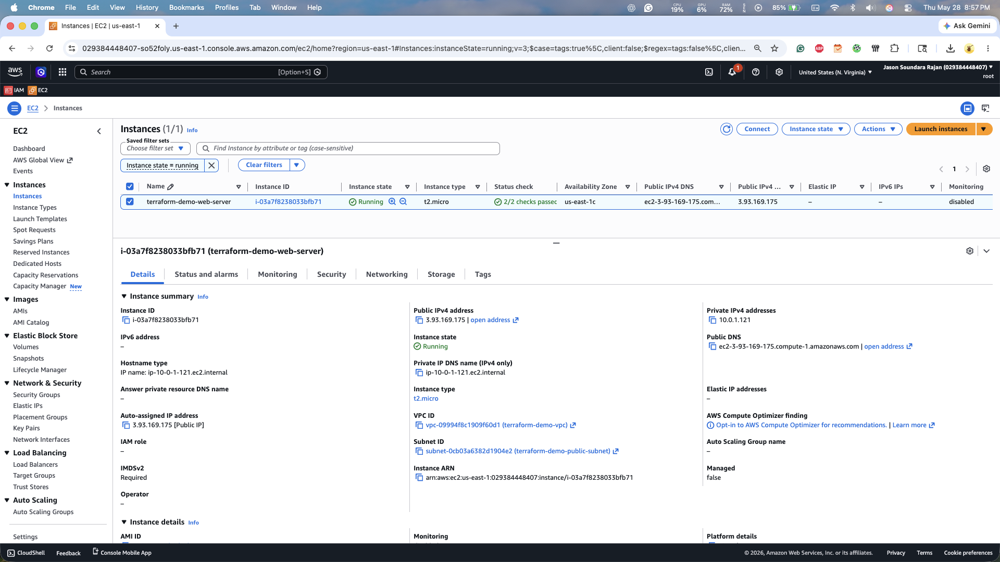
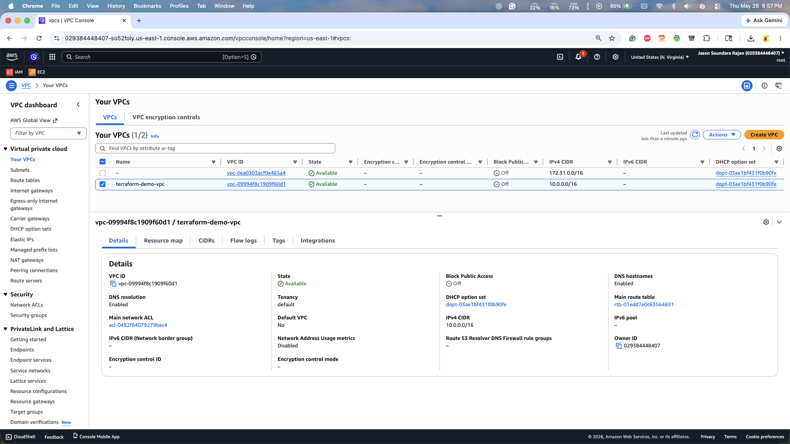
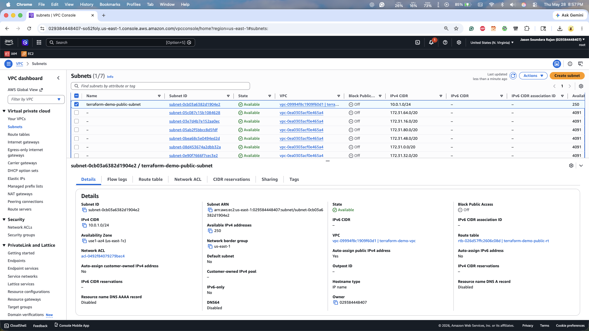
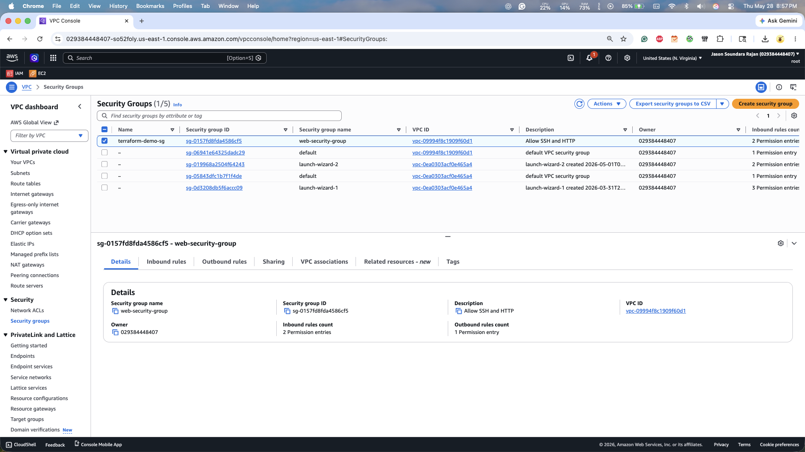
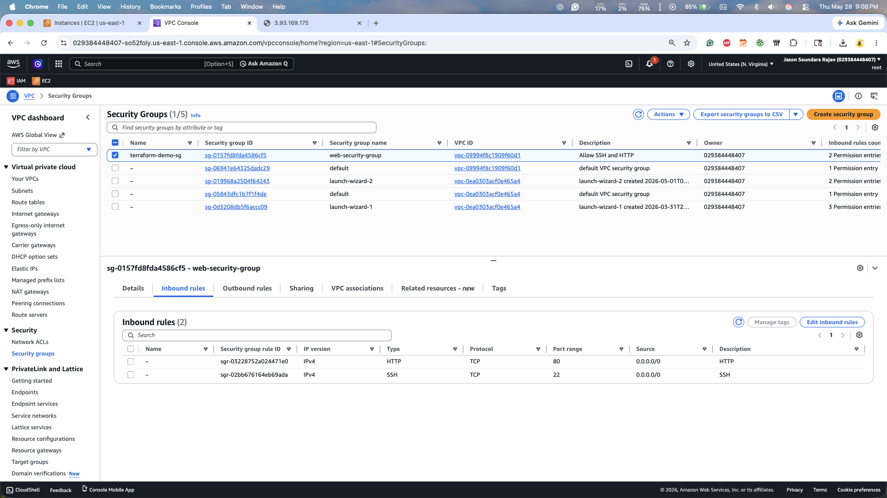
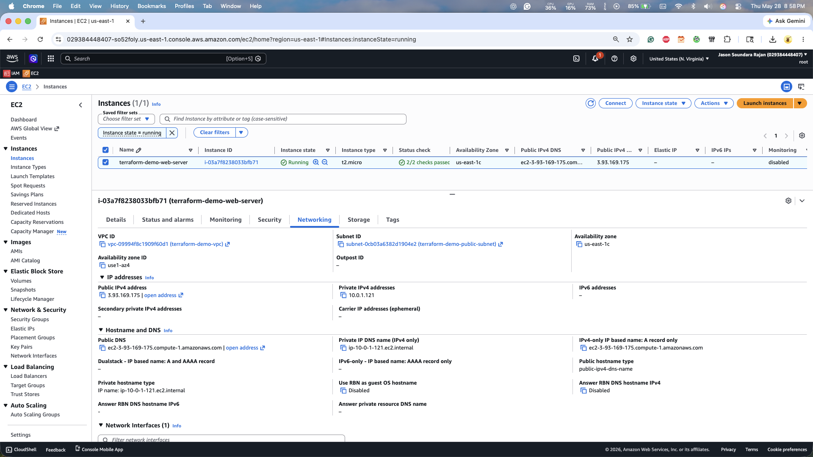
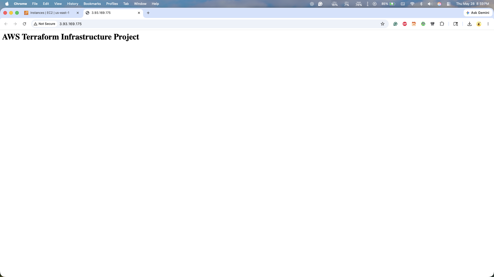
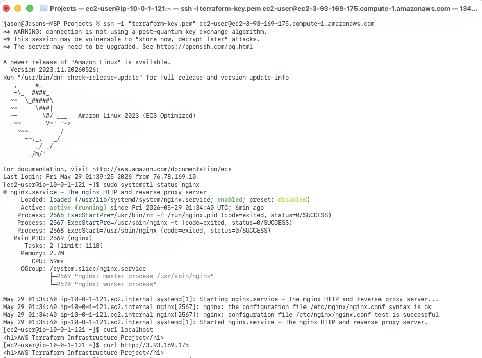

# AWS Infrastructure Automation with Terraform

## Overview

This project demonstrates Infrastructure as Code (IaC) using Terraform to provision and manage AWS infrastructure in a repeatable and automated manner.

The environment was deployed entirely through Terraform and includes a custom VPC, public subnet, route table, internet gateway, security group, and EC2 instance running an Nginx web server. The project follows AWS networking and security best practices while showcasing hands-on experience with cloud infrastructure provisioning, automation, Linux administration, and AWS networking.

---

## Technologies Used

- AWS EC2
- AWS VPC
- AWS Internet Gateway
- AWS Security Groups
- Terraform
- Amazon Linux 2023
- Nginx
- Git
- GitHub

---

## Project Architecture

### AWS Infrastructure Components

- Custom VPC (`10.0.0.0/16`)
- Public Subnet (`10.0.1.0/24`)
- Internet Gateway
- Route Table with Internet Access
- Security Group allowing:
  - SSH (Port 22)
  - HTTP (Port 80)
- EC2 Instance (`t2.micro`)
- Automated Nginx Installation using User Data

### Infrastructure Flow

```text
Internet
    │
    ▼
Internet Gateway
    │
    ▼
Public Subnet
    │
    ▼
EC2 Instance (Amazon Linux 2023)
    │
    ▼
Nginx Web Server
```

---

## Terraform Resources Provisioned

| Resource | Purpose |
|----------|----------|
| AWS VPC | Isolated network environment |
| Public Subnet | Hosts public-facing resources |
| Internet Gateway | Enables internet connectivity |
| Route Table | Routes traffic to the internet |
| Security Group | Controls inbound and outbound traffic |
| EC2 Instance | Hosts Linux web server |
| User Data Script | Automates Nginx installation and configuration |

---

## Project Structure

```text
aws-terraform-infrastructure-project/
├── README.md
├── screenshots/
│
└── terraform/
    ├── provider.tf
    ├── variables.tf
    ├── vpc.tf
    ├── security_group.tf
    ├── ec2.tf
    ├── outputs.tf
    ├── user_data.sh
    └── .terraform.lock.hcl
```

---

## Deployment Process

### 1. Configure AWS Credentials

Configure AWS CLI credentials using an IAM user with appropriate permissions.

### 2. Initialize Terraform

```bash
terraform init
```

### 3. Validate Configuration

```bash
terraform validate
```

### 4. Review Execution Plan

```bash
terraform plan
```

### 5. Deploy Infrastructure

```bash
terraform apply
```

### 6. Verify Deployment

- SSH into the EC2 instance
- Verify Nginx service status
- Access the application using the public IP address

---

## Validation

### Nginx Service Verification

```bash
sudo systemctl status nginx
```

Result:

```text
Active: active (running)
```

### Application Verification

```bash
curl http://<public-ip>
```

Result:

```html
<h1>AWS Terraform Infrastructure Project</h1>
```

---

## Screenshots

### EC2 Instance



### VPC Configuration



### Subnet Configuration



### Security Group Configuration



### Security Group Inbound Rules



### Networking Configuration



### Nginx Web Server Validation



### SSH Connectivity Validation



---

## Challenges and Troubleshooting

### Issue Encountered

During deployment, EC2 instance creation initially failed due to an EBS root volume sizing mismatch.

Error:

```text
InvalidBlockDeviceMapping:
Volume of size 8GB is smaller than snapshot.
Expected size >= 30GB.
```

### Resolution

The issue was identified through Terraform deployment logs. The custom root volume configuration was removed, allowing AWS to use the default volume settings required by the Amazon Linux 2023 AMI.

This demonstrated practical troubleshooting skills involving Terraform, AWS EC2, and infrastructure deployment errors.

---

## Project Outcome

Successfully provisioned AWS infrastructure using Terraform and deployed a publicly accessible Nginx web server.

The project demonstrated:

- Infrastructure as Code (IaC)
- AWS Networking Fundamentals
- Linux Administration
- Automated Server Provisioning
- Security Group Configuration
- Cloud Deployment Validation
- Infrastructure Troubleshooting
- Git-Based Version Control

---

## Key Skills Demonstrated

- Terraform
- AWS EC2
- AWS VPC
- Internet Gateway Configuration
- Route Table Management
- Security Group Administration
- Linux System Administration
- Nginx Deployment
- Infrastructure Automation
- Git & GitHub
- Cloud Troubleshooting
- Infrastructure as Code (IaC)

---

## Future Enhancements

- Deploy applications using Auto Scaling Groups
- Add an Application Load Balancer (ALB)
- Implement CloudWatch Monitoring and Alerts
- Configure Terraform Remote State in S3
- Implement CI/CD using GitHub Actions
- Deploy a Multi-Tier Architecture
- Integrate Route 53 DNS Management
- Add Infrastructure Security Scanning

---

## Author

Jason Soundara Rajan
